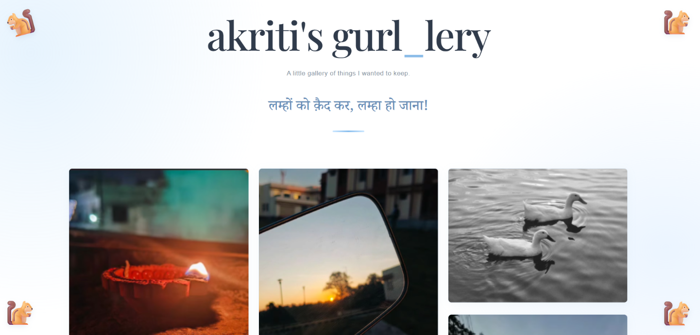

# ♡ Akriti's Gurl_Lery

**Internship Task 2 — Personal Photo Gallery**

A personal photo gallery created to preserve little moments and memories. The website features a soft white-and-blue aesthetic, cute squirrel accents, responsive photo cards, and an interactive lightbox for viewing photos.

## ✨ Features

- Responsive photo gallery layout
- Soft white-and-blue aesthetic
- Cute squirrel decorations
- Interactive lightbox to view photos
- Personalized captions and design
- Simple and user-friendly interface

## 🛠️ Technologies Used

- HTML5
- CSS3
- JavaScript

## 📁 Project Structure
akritis-gurl-lery/
├── index.html
├── style.css
├── script.js
└──
    ├── img1.jpg
    ├── img2.jpg
    └── akriti'sgallery.png
    └── ...
## ♡ Preview

## 🚀 How to Run

1. Clone or download this repository.
2. Open the project folder.
3. Open `index.html` in your browser.
4. Enjoy the gallery!

## 🎯 Purpose

This project was developed as part of Internship Task 2 to practice frontend development, responsive styling, DOM manipulation, and JavaScript event handling.

---

Made with ♡ by Akriti Singh
